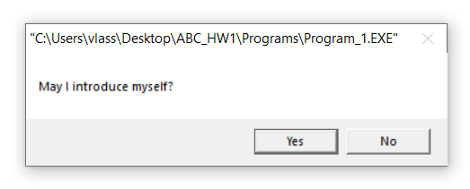
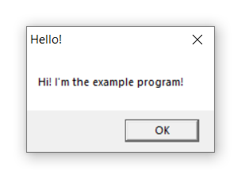
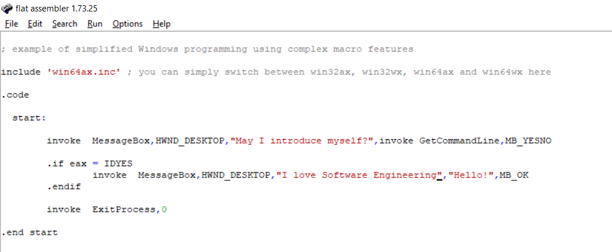
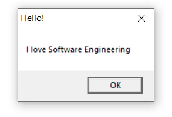
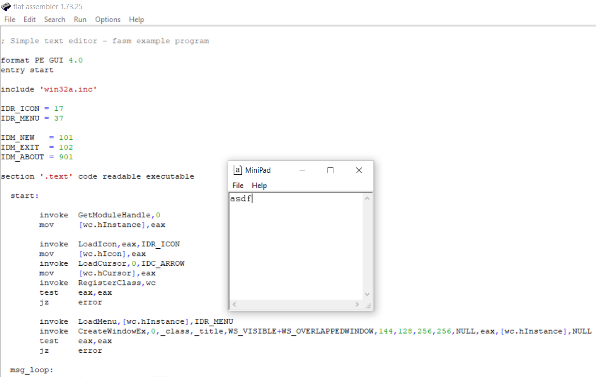
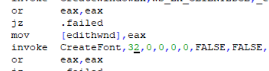
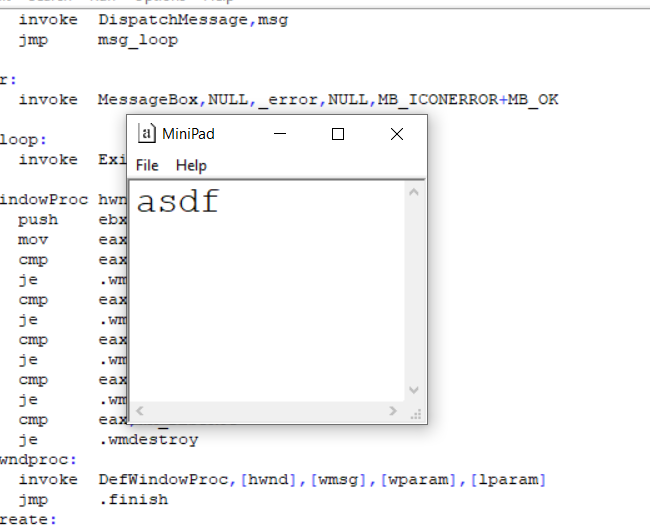
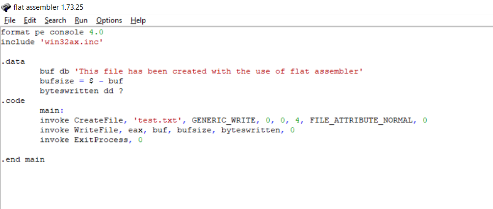
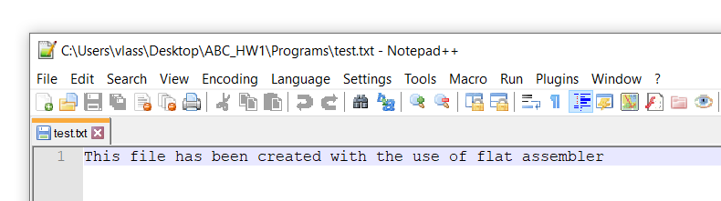

# Власюк Александр, БПИ191

## Программа №1:

"Hello world". Исходный код программы: 

При запуске программы появляется диалоговое окно: 

Если нажать на кнопку "YES", то откроется окно с сообщением:

Можно изменить сообщение, которое показываетcя в данном окне

## Программа №2:

Данная программа представляет собой простой блокнот. 

Попробуем изменить размер шрифта в блокноте: 

## Программа №3:

Попробуем написать программу, создающую текстовый файл.

Результат выполнения программы: 

