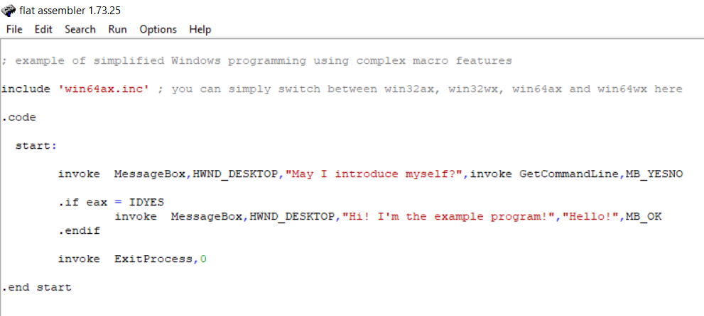

# Власюк Александр, БПИ191

## Программа №1:

"Hello world". Исходный код программы: 

При запуске программы появляется диалоговое окно: 

Если нажать на кнопку "YES", то откроется окно с сообщением:

Можно изменить сообщение, которое показываетя в данном окне

