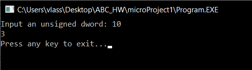
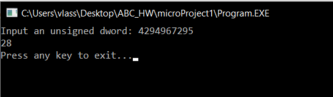
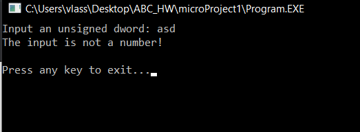
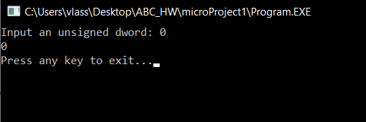

# Власюк Александр, БПИ191

# Микропроект-1

## Вариант 8. Условие:
Разработать программу определения
количества чисел Каллена, не
превышающего величины беззнакового
двойного машинного слова.

Исходный код, исполняемый файл и пояснительная записка к программе прикреплены выше.
Протестируем работу программы.

## Тест 1:
При вводе числа 10 программа выводит число 3.
Действительно, всего 3 числа Каллена не больше числа 10: это 1, 3 и 9.

## Тест 2:
Попробуем ввести максимально возможное беззнаковое двойное слово:

Программа выводит число 28, что является верным ответом.

## Тест 3:
Попробуем ввести не число:

Программа сообщает о некорректном вводе и завершает работу.

## Тест 4:
При вводе числа 0, программа выводит 0, так как все числа Каллена - натуральные.

Спасибо за внимание!

