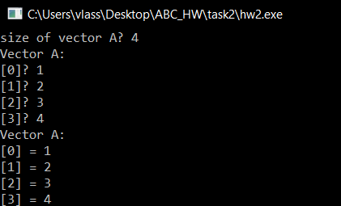

# Власюк Александр, БПИ191

# Программа для обработки одномерных массивов на FASM.

## Вариант 8. Условие:
На основании введенного массива A создать массив B т.ч.:
if (A[i] > 5): B[i] = A[i] + 5
else if (A[i] < 5): B[i] = A[i] - 5
else: B[i] = 0

## Объявление данных:

## Основная секция программы:

Здесь осуществляется вызов подпрограмм.

## VectorInput

В данной подпрограмме осуществляется ввод массива A.

Сначала пользователь вводит кол-во элементов в массиве. 
Если введённое число меньше 0, то выводится сообщение об ошибке и программа завершает работу:

Далее в данной подпрограмме выполняется цикл, 
при выполнении которого пользователь последовательно вводит элементы массива A.

## VectorOutA

Далее выполняется подпрограмма VectorOutA, 
которая с помощью цикла выводит элементы массива A:

## VectorB

Данная подпрограмма вычисляет вектор B.

В ней реализован блок if, else if, else:

Сначала сравниваем значение текущего элемента массива A с 5.
Если больше, то выполняется метка greaterThan5, 
в которой мы присваиваем B[i] = A[i] + 5

Если элемент не больше 5, то проверяем, меньше ли он -5:
Соответственно, при положительном результате сравниния,
выполняется метка lessThanNeg5: B[i] = A[i] - 5

При отрицательном результате обоих сравнений,
B[i] = 0

Далее - увеличиваем счетчик проходов, передвигаемся к следующим элементам массивов
и продолжаем цикл:

## VectorOutB

Последняя подпрограмма - вывод вектора B.
Реализована аналогично с VectorOutA.

## Секция импорта:

# Тестирование

## Тест 1:

Проверим работу программы при вводе неположительного размера массива A:

Успешно.

## Тест 2:

Простой тест. Все элементы больше 5 должны увеличиться на 5, меньше -5 - уменьшиться на 5,
а остальные - обнулиться.

## Тест 3:

Введем массив по-сложнее:

Результат верный

## Тест 4:

Введем в массив элементы с пограничными значениями для двойного слова:

Как видно, программа успешно отработала на всех тестах. 

Спасибо за внимание!

