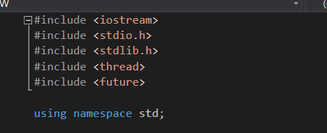
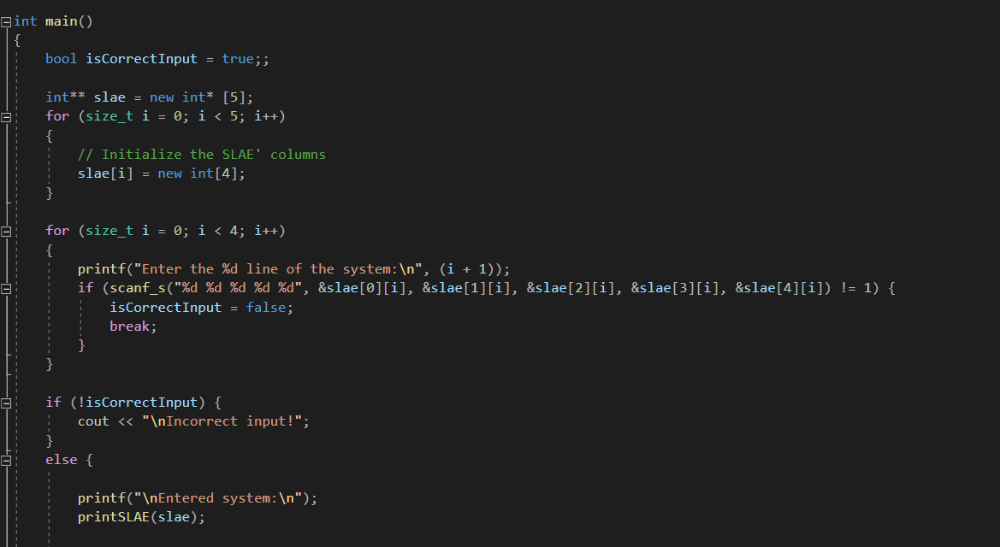
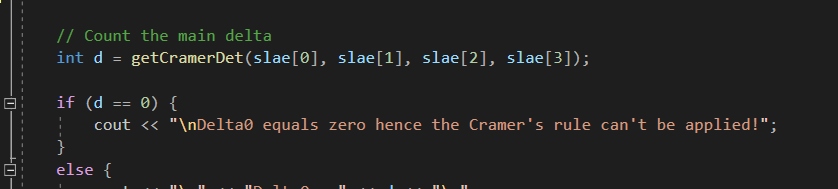
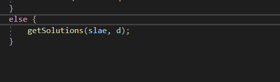
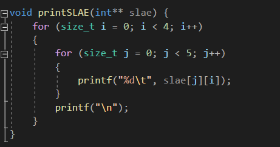
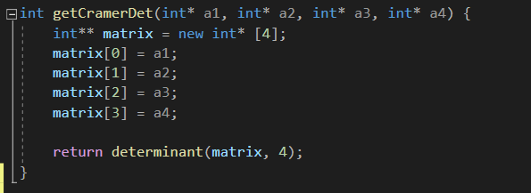
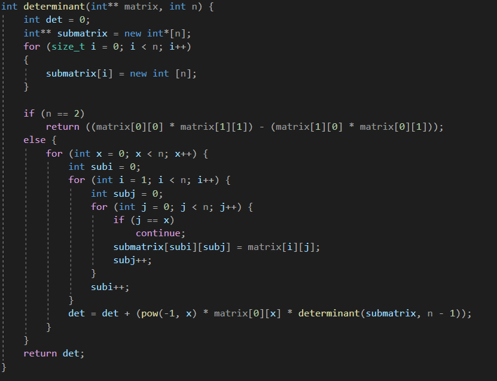

# Власюк Александр, БПИ191

# Практические приемы построения многопоточных приложений.

## Вариант 8. Условие:
Используя формулы Крамера, найти решение системы из 4х линейных уравнений при 4х неизвестных.
Предусмотреть возможность деления на ноль. Входные данные:
коэффициенты системы. Оптимальное количество потоков выбрать
самостоятельно.

## Принцип реализации
После ввода коэффицентов системы пользователем в консоль, сразу вычислим главный детерминант матрицы системы.
Если он равен нулю, то программа завершает работу, т.к. метод Крамера нельзя применить к такой системе.
Иначе - создаем 4 потока, в каждом из которых считаем вспомогательные определители (по методу Крамера).
После окончания работы всех потоков, получаем решения системы, деля соответствующие вспомогательные детерминанты на главный.

Таким образом, многопоточность программы строится по модели "Управляющий и рабочие".

## Секция импорта

## Метод main
В первую очередь - принимаем на ввод от пользователя коэффиценты системы и выводим их на экран.

Далее - считаем основной определитель системы с помощью метода getCramerDet, и если он равен 0, завершаем программу.

Иначе - вычисляем вспомогательные определители в разных потоках и выводим решения системы.

## Метод printSLAE
Выводит матрицу коэффицентов системы

## Метод getCramerDet
Составляет матрицу 4 на 4 из переданных столбцов системы и возвращает её определитель с помощью метода determinant

## Метод determinant
Вычисляет определитель квадратной матрицы с помощью рекурсии.

