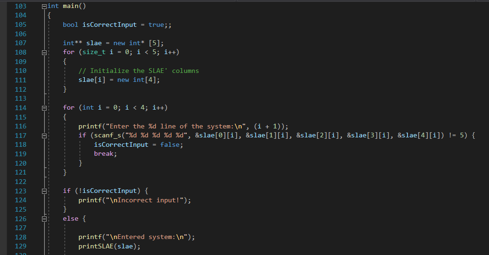

# Власюк Александр, БПИ191

# Разработка многопоточных приложений с использованием OpenMP.

## Вариант 8. Условие:
Используя формулы Крамера, найти решение системы из 4х линейных уравнений при 4х неизвестных.
Предусмотреть возможность деления на ноль. Входные данные:
коэффициенты системы. Оптимальное количество потоков выбрать
самостоятельно.

## Принцип реализации
После ввода коэффицентов системы пользователем в консоль, сразу вычислим главный детерминант матрицы системы.
Если он равен нулю, то программа завершает работу, т.к. метод Крамера нельзя применить к такой системе.
Иначе - задаем 4 потока в omp, в каждом из которых, с помощью директивы parallel sections,  считаем вспомогательные определители (по методу Крамера).
После окончания работы всех потоков, получаем решения системы, деля соответствующие вспомогательные детерминанты на главный.

Таким образом, многопоточность программы строится по модели "Управляющий и рабочие".

## Источники:
[Википедия: метод Крамера](https://ru.wikipedia.org/wiki/%D0%9C%D0%B5%D1%82%D0%BE%D0%B4_%D0%9A%D1%80%D0%B0%D0%BC%D0%B5%D1%80%D0%B0)
[MS Docs: Директивы OpenMP](https://docs.microsoft.com/en-gb/cpp/parallel/openmp/reference/openmp-directives?view=msvc-160)
[Методика разработки многопоточных приложений](https://rsdn.org/article/baseserv/RUThreadingMethodology.xml)

## Секция импорта

## Метод main
В первую очередь - принимаем на ввод от пользователя коэффиценты системы, проверяем ввод на корректность и выводим полученную систему на экран.

Далее - считаем основной определитель системы с помощью метода getCramerDet, и если он равен 0, завершаем программу.

Иначе - находим решения системы с помощью метода getSolutions.

## Метод printSLAE
Выводит матрицу коэффицентов системы

## Метод getCramerDet
Составляет матрицу 4 на 4 из переданных столбцов системы и возвращает её определитель с помощью метода determinant

## Метод determinant
Вычисляет определитель квадратной матрицы с помощью рекурсии.

## Метод getSolutions
Вычисляет вспомогательные определители системы с помощью потоков, затем вычисляет решения системы и выводит их.

Delta0 уже найден. Найдем delta1-delta4 параллельно, с помощью директивы parallel sections. 

Подождем, пока все потоки отработают, с помощью директивы barrier. После этого найдем решения и выведем их.

# Тестирование программы

## Тест 1
Введем случайную систему

Как видно, программа успешно отработала и вывела решения системы.

## Тест 2
Введем систему, главный определитель который равен 0

Как видно, программа сообщает о том, что данную систему невозможно решить методом Крамера, и завершает работу.

## Тест 3
Попробуем совершить некорректный ввод:

Таким образом, программа на разных входных данных работает корректно. 
Спасибо за внимание!
